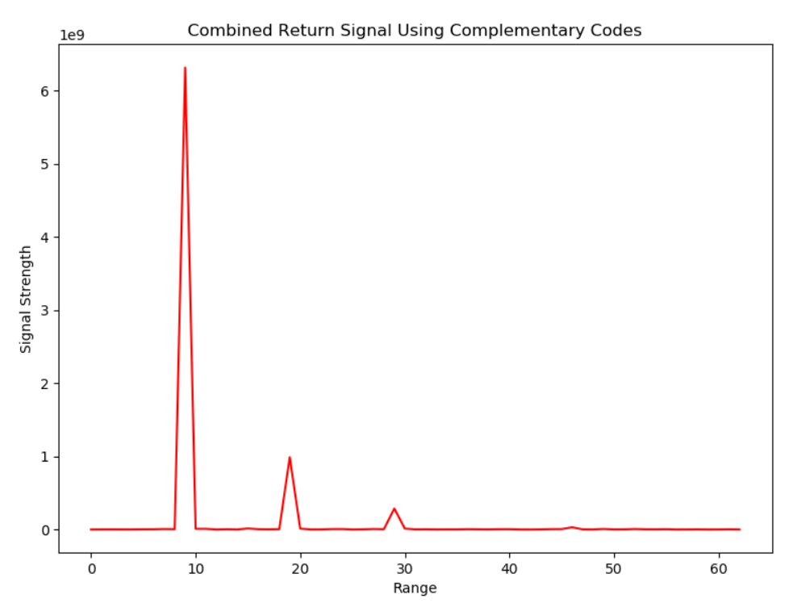

# Complementary Coding

## Intro

[Complementary Coding](https://en.wikipedia.org/wiki/Complementary_sequences) signal processing techniques can be used to aid radar detection and ranging.

As the filtered pulses combined cancel out the sidelobes, it can be used to distinctively identify a target.

This repo uses an 8 baud complementary code for analysis:
    
    Sequence A = [1,1,1,-1,1,1,-1,1]
    Sequence B = [1,1,1,-1,-1,-1,1,-1]

## Output

### Signal Template for 8 baud Complementary Code

The figure below plots both sequences over a length of time using 80 data points:

Each sequence is then [Autocorrelated](https://en.wikipedia.org/wiki/Autocorrelation) with each other and can be seen in the blue and green plot.
Unlike Barker Codes, these individual signals have high sidelobes which is undesirable in determining targets.
However, when summed, the out-of-phase sidelobes cancel out, leaving only the main signal in the center.

### Sample Radar Return of 2 Complementary Pulse

The figure below represents a sample radar return of 2 8-baud Complementary Pulses emitted over the same area.

The spikes in signal strength may represent a detected target but otherwise difficult determine.

Correlating with its known pulse template (filtering) yields better a picture.

However, the sidelobs still make it difficult to see if there is an actual target.

Combining the two signals using the concept of Complementary Codes shows:

As it can be seen in the figure above, there are three definite targets detected.

